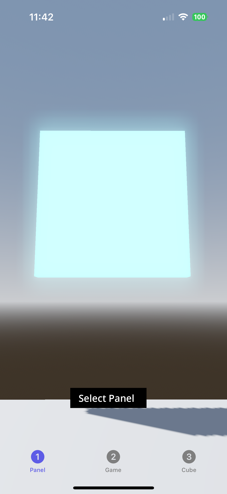

# A SwiftGodotKit Demo

This demo contains an iOS application and a Godot project intended to showcase some of the use cases/ abilities of [SwiftGodotKit](https://github.com/migueldeicaza/SwiftGodotKit). To test out this demo, first clone this repository. Then open up the iOS application SwiftGodotKitDemoApp in Xcode and update the signing and bundle id. Setting the SwiftGodotKit package via linking to GitHub was not working for me so I had to manually clone the SwiftGodotKit package and set my project to use the local package. If this is still necessary, clone SwiftGodotKit as well and link to that package locally, otherwise just connect to the SwiftGodotKit package on GitHub. Then set the build device to your actual iOS device (the Godot Engine can't run on the simulator) and run the the SwiftGodotKitDemoApp iOS application with your iOS device as the build destination.

The application showcases a few key aspects of SwiftGodotKit, namely how to send signals to and from Godot, how to share the GodotApp across views, how to have multiple scenes running simultaneously, and a few potential example use cases. For a good tutorial that explains things in more depth, see [this tutorial](https://christianselig.com/2025/05/godot-ios-interop/) by Christian Selig.

## SwiftGodotKitDemoProject
- **src/CharacterGameplay** - Game like scene that allows you to control a character via a joystick and screen drag motions. Pressing the settings button will pull up a menu where you can choose to close out of the game, which will close the view and deallocate the subview from the Root scene inside of the iOS app.
- **src/SelectableSquares** - Scene that allows you to swipe around via screen drag motions. When you are focused on a square, the square will glow. Pressing "Select Panel" will send a signal causing a view to be presented in the iOS app with the color of the panel selected.
- **src/Root** - Empty root scene which is set as the start scene. This is necessary because the other scenes will be added as SubViewPorts to this root scene since there cannot be multiple scene instances running in an iOS app at the same time.
- **src/RotatingCubes** - Scene that rows a simple rotating cube that can have its color changed via a signal.

## SwiftGodotKitDemoApp
- **demo.pck**-  Packed up godot project (Created by using Export Pck/Zip for the project)
- **GodotSwiftMessenger** - Singleton that handles signals between Godot and Swift.
- **GameStartView** - Starts the CharacterGampeplay scene
- **PanelSelectionView** - Starts the SelectableSquares scene
- **RotatingCubeView** - Starts the RotatingCubes scene
- **GodotSceneWindowView** - View that wraps the callback logic to place each GodotWindow in its own 3DWorld and provides loading spinner until scene has loaded

## Tips and Tricks from Development
- Make sure you add **-lc++** to Other Linker Flags under **Targets** > **YourAppName** > **Build Settings** and add **MetalFX.framework** under **Targets** > **YourAppName** > **Link Binary with Libraries**
- You can initialize GodotApp in your root App and pass it as an environment variable to your root view to be accessed by any subviews.
- GodotAppView **must** be instantiated before any GodotWindows can be created. This is a feature of SwiftGodotKit because it makes GodotWindows much easier to handle behind the scenes.
- JIT compilation is not allowed on iOS devices so for .NET to be used with SwiftGodotKit, the C# scripts need to be statically compiled. There is not currently a method of doing this as of writing this so SwiftGodotKit at the moment can only be used with either Swift or GDScript.
- To run multiple scenes simultaneously/across using SwiftGodotKit, you must use a workaround. You can create separate SubviewPortContainers and set them to have their own WorldEnvironments. These can be added to the starting root scene  as needed to create new scenes in different views. The root scene then in this case needs to be empty, otherwise anything that is in the root scene will appear in the SubviewPortContainers. This is best also as all GodotWindows need a GodotAppView to be initialized so ideally the root view has as little information as possible upon initialization.
- Only one .pck file can be used per iOS app so all the scenes you need must be contained in a single Godot project.
- To get nodes from a scene to work with, you need to use `getNode` on the scene. This should be called from the root scene, which can be accessed via the following code:

       let sceneTree = Engine.getMainLoop() as? SceneTree
       sceneTree.currentScene.getNode("path")

## App Screenshots
**GameStartView**
   

**CharacterGameView**
   

**PanelSelectionView**
   

**PanelSelectionView (With ColorSheetView)**
   

**RotatingCubeView**
   
